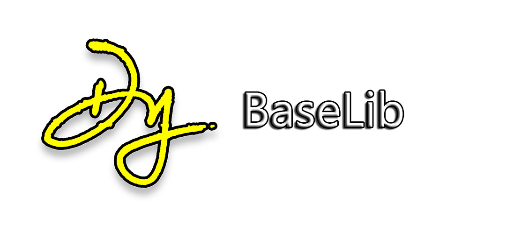
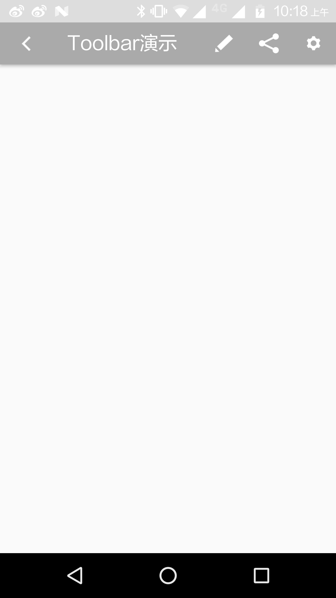
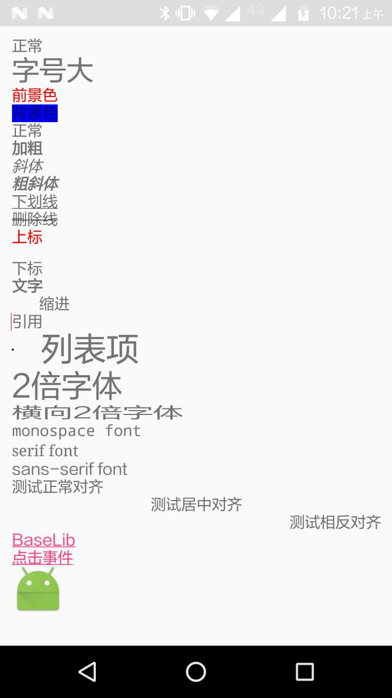
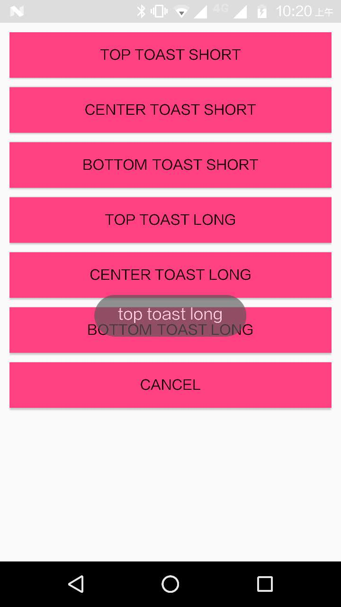
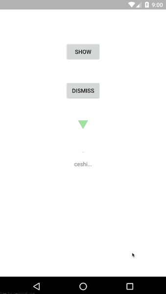

# BaseLib
Lightweight Android project dependencies  (Welcome to **Star** and **Fork**)
***

<h2>Pictures show</h2>

   

<h2>Document</h2>

- [wiki](https://github.com/duyangs/ZBaseLib/wiki)

<h2>How to</h2>
<pre><code>
Add it in your root build.gradle at the end of repositories:

	allprojects {
		repositories {
			...
			maven { url 'https://jitpack.io' }
		}
	}
    
Add the dependency

	dependencies {
	        compile 'com.github.duyangs:ZBaseLib:0.1.4'
	}
    
</code></pre>

<h2>Open source libraries used in the project</h2>

- [ImmersionBar](https://github.com/gyf-dev/ImmersionBar)
- [android-shapeLoadingView](https://github.com/zzz40500/android-shapeLoadingView)
- [Toasty](https://github.com/GrenderG/Toasty)

<h2>License</h2>
<pre><code>
Copyright 2017 杜洋
Licensed under the Apache License, Version 2.0 (the "License");
you may not use this file except in compliance with the License.
You may obtain a copy of the License at
   http://www.apache.org/licenses/LICENSE-2.0
Unless required by applicable law or agreed to in writing, software
distributed under the License is distributed on an "AS IS" BASIS,
WITHOUT WARRANTIES OR CONDITIONS OF ANY KIND, either express or implied.
See the License for the specific language governing permissions and
limitations under the License.
<pre><code>
